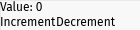
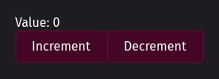

_The discontinued Iced-based version of Prettygooey can still be found [here](https://github.com/pieterdd/prettygooey/tree/0.1.1)._

# Prettygooey

[](https://crates.io/crates/prettygooey)
[](https://docs.rs/prettygooey/latest/prettygooey/theme/struct.Theme.html)

Prettygooey is a set of themed UI components for the [floem](https://github.com/lapce/floem) GUI library. Works on Windows, Linux and Mac.


⚠️ **Prettygooey, like floem, is experimental software.** ⚠️

## First time using floem?

Floem's documentation is available [here](http://lapce.dev/floem/floem/). You might notice that it incorporates familiar concepts from other UI frameworks, including:

- Interface composition using nestable horizontal and vertical widget containers
- A styling system that brings many CSS-like features to Rust, without the overhead of a browser runtime
- Automatic propagation of data changes to your UI using signals, as seen in [SolidJS](https://www.solidjs.com/)
- Implementation of UIs using functions, similar to Jetpack Compose
- Keyboard accessibility

For a mimimal example involving a counter that can be incremented/decremented, have a look at [this file](examples/counter_floem/src/main.rs). It looks quite basic when rendered:



If you've familiarized yourself with the floem's basics, keep reading to find out how to spice things up.

## Getting started with Prettygooey

The Prettygooey workflow involves:

1. Creating an instance of [`prettygooey::theme::Theme`](https://docs.rs/prettygooey/latest/prettygooey/theme/struct.Theme.html). `Theme::default()` lets you use default settings.
2. Using the widget creation methods in `Theme` to build your UI. If Prettygooey doesn't have exactly what you want, you can mix and match with self-written UI components. You can keep using floem's `v_stack` and `h_stack` methods to lay out your components.
3. Wrapping your window contents in Prettygooey's padded container to ensure your widgets don't stick to the side of the window.
4. Wrapping the padded container in Prettygooey's primary container to apply the theme's window background.

[Over here](examples/counter_prettygooey/src/main.rs) you'll find the above example ported to Prettygooey. Here is a reference render:



These components are still sticking to one another. You'll probably want to add a small gap between them. `v_stack` and `h_stack` can automatically add those gaps, provided that you request it:

```rust
v_stack(/* .. */)
	.style(|s| s.gap(0.0, 10.0))
```

The above will add no horizontal gap and a vertical 10-pixel gap.

## Where to go from here

For a list of available widgets with screenshots and examples, see the [code docs](https://docs.rs/prettygooey/latest/prettygooey/theme/struct.Theme.html#implementations).

If you'd like to see more than a few loose snippets, check out the [showcase example](examples/showcase/src/main.rs). It's the source code for the screenshot at the top of the README.

## Not quite what you're looking for?

I'm not aware of any other floem UI component libraries right now.

As far as Rust UI libraries go, [Iced](https://iced.rs/) is a well-known one. Device manufacturer System76 is using it to implement its own desktop environment. You might be able to build onto their work by checking out [libcosmic](https://github.com/pop-os/libcosmic). Be advised that its learning curve may be a bit steeper than floem's, and that the library is primarily intended for use by applications that are native to the Cosmic desktop environment.

If you're willing to consider Electron-like solutions that are not completely native and may have a larger resource footprint, I'd definitely check out [Tauri](https://tauri.app/). Since it's built on HTML/JS/CSS, you can use it with any web-based UI framework.
