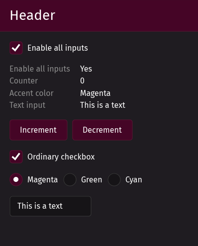

_This library has migrated to the Floem GUI framework and is no longer being maintained. Feel free to check out [Floem UI Kit](https://github.com/pieterdd/floem-ui-kit)._

# Prettygoey

[](https://crates.io/crates/prettygooey)
[](https://docs.rs/prettygooey/latest/prettygooey/theme/struct.Theme.html)

Prettygooey is a set of themed UI components for the [iced](https://iced.rs/) GUI library. Works on Windows, Linux and Mac.



⚠️ **Prettygooey, like iced, is experimental software.** ⚠️

## First time using iced?

The [official iced book](https://book.iced.rs/) was fairly short at the time of writing, so my limited knowledge was pieced together from [docs.rs](https://docs.rs/iced/latest/iced/index.html) snippets, reading source code and visiting their [forums](https://discourse.iced.rs/).

The simplest way to create a GUI in iced is with an [`iced::Sandbox`](https://docs.rs/iced/latest/iced/trait.Sandbox.html). It kind of behaves like a window. You'll have to implement four methods:

- `new`: prepares your initial state
- `title`: controls the title of the window
- `update`: more on this later
- `view`: renders your widgets

### Thinking in widgets

Iced, like many GUI frameworks, works with containers (i.e. groups of widgets) and widgets. Containers help you lay out your widgets, and common examples of them include a row or a column. Containers can contain containers, too.

Suppose you want to create a confirmation dialog. Such a layout would probably have the following structure:

- A column container
  - A text widget with label "Are you sure?"
  - A row container
    - A "Yes" button
    - A "No" button

When using vanilla iced widgets, this would look something like this:


Row and column containers have some useful modifier functions:

- `spacing` adds a gap between your widgets to let your layout breathe.
- `padding` adds spacing on the outside of the container. This keeps your text from sticking to the side of the window.

Here's a simple example putting the above into practice:

```rust
fn view(&self) -> Element<'_, Self::Message> {
	column!(
		text("Are you sure?"),
		row![button("Yes"), button("No")].spacing(10)
	)
	.spacing(20)
	.padding(10)
	.into()
}
```

### Let's run this thing

You've defined your UI, but it won't show up until you invoke it. In the example below, we initialize a window with mostly default settings.

```rust
MySandbox::run(Settings {
	window: window::Settings {
		size: (400, 450),
		position: Position::Centered,
		..window::Settings::default()
	},
	..Settings::default()
})
```

You can find the full list of available settings [here](https://docs.rs/iced/latest/iced/settings/struct.Settings.html).

### Interactivity

Many widgets allow for some kind of user interaction. Examples include your garden variety button, text input or checkbox. These interactions produce events. For a checkbox, a typical interaction plays out like this:

1. The checkbox takes its current state from a variable
2. User clicks the checkbox
3. The checkbox emits an event containing the new state
4. Your Sandbox's `update` function reacts to that new state by updating the variable to the new state

You get to decide what the event looks like. Your Sandbox can designate a specific enum as its [Message type](https://docs.rs/iced/latest/iced/trait.Sandbox.html#associatedtype.Message). For example:

```rust
#[derive(Debug, Clone)]
enum SpaceshipSandboxMessage {
    BoostersEnabledChanged(bool),
    ShieldSelectionChanged(Shield),
    CommanderNameChanged(String),
    RebootButtonPressed,
}
```

In the case of a [checkbox](https://docs.rs/iced/latest/iced/widget/fn.checkbox.html), you set the event as follows:

```rust
let chk_enable_boosters = checkbox(
	"Enable boosters",
	 self.enable_boosters,
	 Self::Message::BoostersEnabledChanged,
);
```

Your Sandbox's `update` function will be called whenever such an event is emitted. There you can respond accordingly:

```rust
fn update(&mut self, message: Self::Message) {
	match message {
		Self::Message::BoostersEnabledChanged(value) => {
			self.enable_boosters = value;
		}
	}
}
```

## Getting started with Prettygooey

In your Sandbox's constructor, create an instance of [`prettygooey::theme::Theme`](https://docs.rs/prettygooey/latest/prettygooey/theme/struct.Theme.html). You'll use this object to instantiate Prettygooey widgets.

```rust
fn new() -> Self {
	Self {
		theme: Theme {
			accent_color: AccentColor::Magenta,
		},
	}
}
```

In your Sandbox's `view` function, return an instance of our primary container to apply the background.

```rust
fn view(&self) -> Element<'_, Self::Message> {
	// Pass a row or column of widgets to the container
	self.theme.primary_container(column![]).into()
}
```

All supported widgets can be created via the Theme instance.

```rust
let button = self.theme.button("Click me");
```

Prettygooey widgets may provide optional customizations. Take the Text widget for example. By importing the extension trait [`prettygooey::theme::TextExt`](https://docs.rs/prettygooey/latest/prettygooey/theme/trait.TextExt.html), you expose a `variant` method that'll let you switch the variant to Dimmed:

```rust
self.theme
	.text("Theme selection")
	.variant(TextVariant::Dimmed),
```

## Where to go from here

For a list of available widgets with screenshots and examples, see the [code docs](https://docs.rs/prettygooey/latest/prettygooey/theme/struct.Theme.html#implementations).

If you'd like to see more than a few loose snippets, check out the [showcase example](https://github.com/pieterdd/prettygooey/blob/main/examples/showcase/src/main.rs). It's the source code for the screenshot at the top of the README.

## Not quite what you're looking for?

Pop! OS's [libcosmic](https://github.com/pop-os/libcosmic) implements a much wider range of iced widgets and is backed by device manufacturer System76. On the other hand, libcosmic's learning curve may be a bit steeper. The library is primarily intended for use by applications that are native to the Cosmic desktop environment.

That said, I'd still check it out and make up your own mind.
